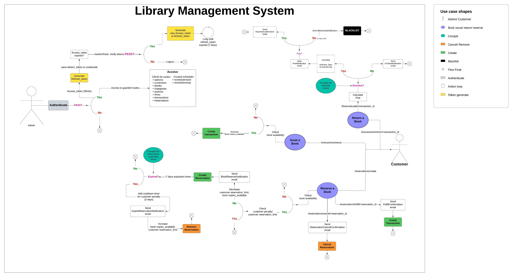

## A LIBRARY MANAGEMENT SYSTEM API:

- Built with NestJS, TypeORM
- SQLite database for fast on-app db connection
- nodemailer: with notifications service sending mail to customer
- using authGuard: guarding api endpoints with jwt
- seeders: auto generate data seeds using typeorm_seeding lib (cmd: npm run seed:run)
- interceptors: re-format response for better look
- cronjob: daily checking for some features, combine with nodemailer to automatically send notifications to users

# api/v1

# /admins

    CRUD features for admins table: (Guarded)
    POST: /add - Add new admin to system {body: {email, username, password}}
    GET: / - Get all admins
    GET: /:id - Get admin by {id}
    PATCH: /:id - Update admin by {id} {body: {...}}
    DELETE: /:id - Delete admin by {id}

# /auth

    POST: /login - Admin login system, generating jwt tokens (access_token for authenticate, refresh_token saved in HTTP Only Cookie) {body: {username, password}}
    POST: /refresh - Generating new jwt tokens for authenticate (require refresh_token saved in Cookie)

# /authors

    CRUD features for authors table:
    POST: /add - Add new author to system (Guarded) {body: {name}}
    GET: / - Get all authors
    GET: /:id - Get author by {id}
    PATCH: /:id - Update author by {id} (Guarded) {body: {body}}
    DELETE: /:id - Delete author by {id} (Guarded)

# /books

    CRUD features for books table:
    POST: /add - Add new book to system (Guarded) {body: {title, author_id, category_id, copies_available, total_copies, isbn, publication_year}}
    GET: / - Get all books
    GET: /:id - Get book by {id}
    PATCH: /:id - Update book by {id} (Guarded) {body: {...}}
    DELETE: /:id - Delete book by {id} (Guarded)

    GET: /search? - search books by title/author/category/availability

# /categories

    CRUD features for categories table:
    POST: /add - Add new category to system (Guarded) {body: {name}}
    GET: / - Get all categories
    GET: /:id - Get category by {id}
    PATCH: /:id - Update category by {id} (Guarded) {body: {name}}
    DELETE: /:id - Delete category by {id} (Guarded)

# /customers

    CRUD features for customers table: (Guarded)
    POST: /add - Add new customer to system {body: {name, phone, email, address}}
    GET: / - Get all customers
    GET: /:id - Get customer by {id}
    PATCH: /:id - Update customer by {id} {body: {...}}
    DELETE: /:id - Delete customer by {id}

# /fine

    CRUD features for fine table: (Guarded)
    GET: / - Get all fines
    GET: /:id - Get fine by {id}
    PATCH: /:id - Update fine by {id} {body: {overdue_days, overdue_fee, is_paid}}
    DELETE: /:id - Delete fine by {id}

    POST: /calculate/:transaction_id - calculate fine details for transaction by {transaction_id}
    POST: /pay/:fine_id - for customer to pay their fines which calculated by the method above (by {fine_id})

# /reservations

    CRUD features for reservations table: (Guarded)
    GET: / - Get all reservations
    GET: /:id - Get reservation by {id}
    PATCH: /:id - Update reservation by {id} {body: {customer_id, book_id, is_fulfilled}}
    DELETE: /:id - Delete reservation by {id}

    POST: /create - create new book reservation for customer {body: {book_id, customer_id}}
    DELETE: /cancel/:id - cancel book reservation by {reservation_id}
    PATCH: /fulfill/:id - update book reservation to be fulfilled (Book borrowed by user - Update data to transactions table)

# /scheduler

    Cron job for reservations and transactions checking (Guarded)

    - Check the transactions table if the book is returned before due_date (overdue), if not, send mail notification to customer with fine information
    - Check the reservations table if the book is fulfilled (borrowed) before expiration, if not, send mail notification to customer and set the penalty timer for that customer's next book reservation (3 days)
    - Check the fines table if there're any fines that are not paid, if exist, increase overdue_days by 1 every day and send mail notification to customer, if the overdue_days is over 14, set blacklist status for that customer and send blacklisted mail notification

      POST: /start - start the cron job
      POST: /stop - stop the cron job

# /transactions

    CRUD features for transactions table: (Guarded)
    POST: /add - Add new transaction to system {body: {book_id, customer_id, issued_date, due_date}}
    GET: / - Get all transactions
    GET: /:id - Get transaction by {id}
    PATCH: /:id - Update transaction by {id}
    DELETE: /:id - Delete transaction by {id}

    POST: /issue - for customer to request a book issuance {body: {book_id, customer_id, due_date}}
    PATCH: /return/:id - for customer to request a book return by {transaction_id}

- Database tables diagram: https://dbdiagram.io/d/Library-Management-System-665fa307b65d933879840ec9
- Use Case diagram: https://lucid.app/lucidchart/a11fa0a8-60f8-45f4-b531-01823c27e594/edit?viewport_loc=-2157%2C-1635%2C5929%2C2742%2C.Q4MUjXso07N&invitationId=inv_5d6a3b13-02b5-435f-8def-6c0f4056ab6a (Login needed)

